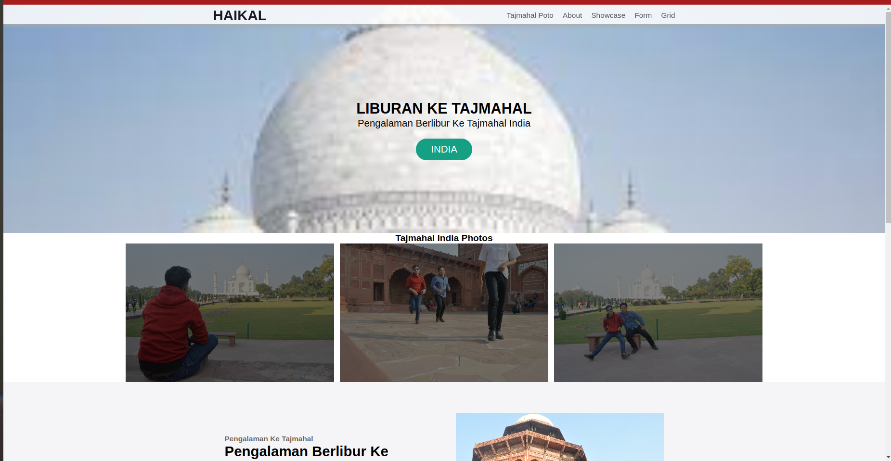
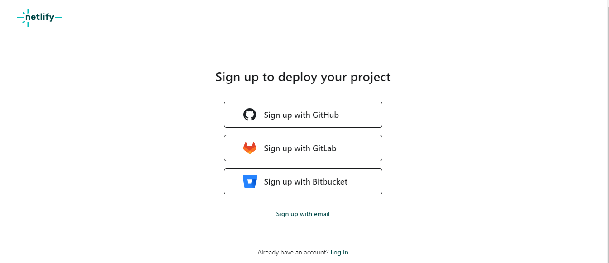
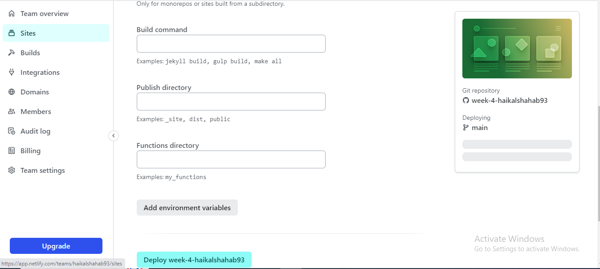

# Muhammad-Haikal-Shahab_Weekly_W4

# Netlify

1. Tahap Pertama Daftarkan Akun Netlfy Dengan Cara menyambungkan Ke Github seperti gambar di bawah ini.

2. Tahap Kedua Setelah Akun Netlify Sudah Terdaftar dan Auto Login , Masuk Ke Menu Team Overview, Dan Klik Add New Site, Import An Existing Project untuk membuat Project Netlify. Seperti gambar di bawah ini.

3. Tahap Ketiga , Setelah itu sambungkan project netlify dengan github repository, kemudian akan terautoriksasi dengan github dan akan muncul repository githubnya, pilih repository yang akan di deploy dan lanjutka proses deploy seperti gambar di bawah ini.

4. Tahap Ke empat ganti nama domain sesuai yang anda inginkan dengan cara memilih site configuration dari site yang kita buat , kemudian pilih site details ubah klik change site name dan ganti nama sesuai yang anda inginkan.

 

hi, i'm [Muhammad Haikal Shahab](https://haikalshahab2.netlify.app), a passionate self-taught full stack web developer and a freelance software engineer from indonesia. my passion for software lies with dreaming up ideas and making them come true with elegant interfaces. i take great care in the experience, architecture, and code quality of the things I build.

  
  
- 💼 i'm work in PT PUSRI Palembang, [email](mailto:haikal.pusri@gmail.com) :)
- 💬 ask me about anything, i am happy to help;

**languages and tools:**  

<code></code>
<code></code>
<code></code>
<code></code>

 
 
 

